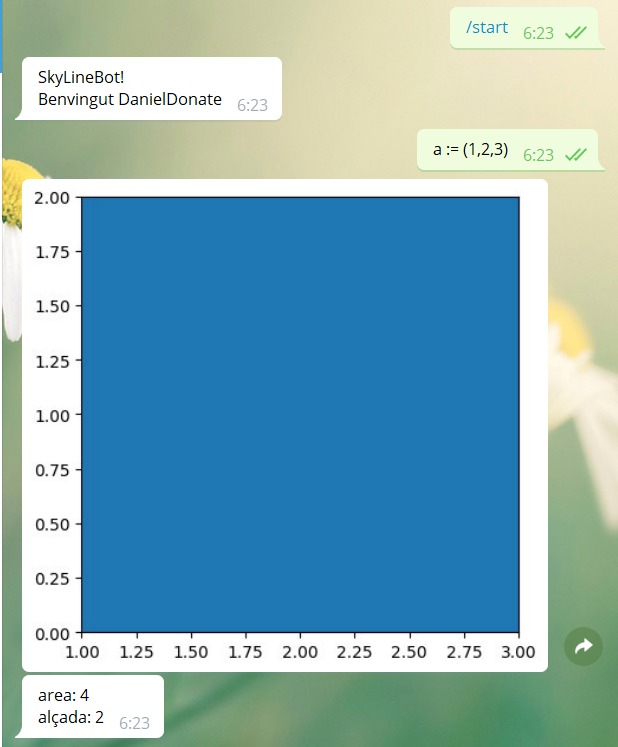
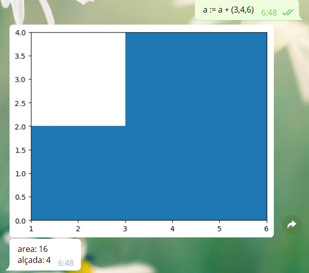
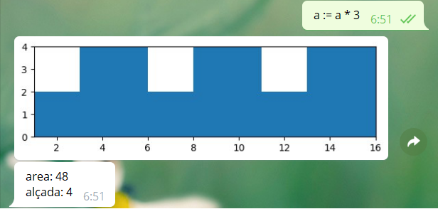
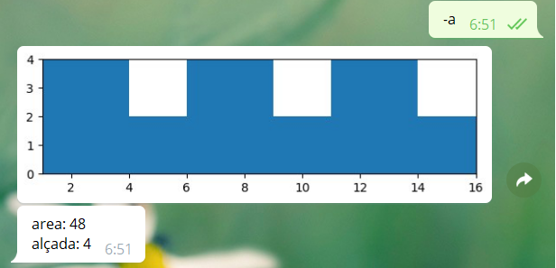
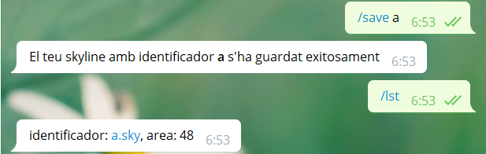
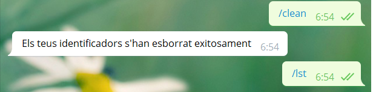
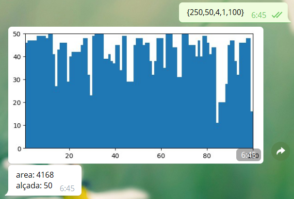

# SkylineBot

L'_skyline_ d'una ciutat mostra una vista horizontal dels seus edificis.


En aquest projecte desenvolupem un chatbot en Telegram per a la manipulació 
d'_Skylines_ via un intèrpret.

## Getting Started

Aquestes instruccions et proporcionaran una còpia del projecte en funcionament a la teva màquina local amb finalitats de desenvolupament i proves.

### Prerequisits

Primer de tot, lògicament, hauràs d'instal·lar i configurar l'App de [Telegram](https://telegram.org/) al teu telèfon si vols fer servir el Bot.
 
Necessites tenir [Python 3](https://www.python.org/) instal·lat al teu ordinador, així com [Java](https://www.oracle.com/java/technologies/javase-java-archive-javase6-downloads.html) (versió 1.6 o superior)
D'altra banda, hauràs d'instal·lar ANTLR4 per l'intèrpret del projecte. Pots fer-ho executant les següents comandes (en un entorn UNIX):

```bash
> cd /usr/local/lib
> sudo curl -O https://www.antlr.org/download/antlr-4.8-complete.jar 
> export CLASSPATH=".:/usr/local/lib/antlr-4.8-complete.jar:$CLASSPATH"
> alias antlr4='java -jar /usr/local/lib/antlr-4.8-complete.jar'
> alias grun='java org.antlr.v4.gui.TestRig'
```
Per poder fer servir ANTLR4 juntament amb Python, hauràs d'instal·lar, addicionalment, la següent llibreria: `antlr4-python3-runtime`.
Pots fer-ho directament amb un cop de `pip` de la següent manera:

```bash
> pip3 install antlr4-python3-runtime
```

A més a més, a l'ordinador on s'executa el bot, cal tenir instal·lades les següents llibreries: `python-telegram-bot` (pel bot) i `matplotlib` (per la visualització dels skylines).
Novament, pots utilitzar pip:

```bash
> pip3 install python-telegram-bot
> pip3 install matplotlib
```

### Generant un _Access token_ 

Necessitaràs un _Access token_ per identificar el teu bot. Essencialment:
  - Visita el [@BotFather](https://telegram.me/botfather)
  - Fes servir la comanda `/newbot` i dona la informació que et demana
  - Desa en un fitxer `token.txt` el teu access token, al mateix directori on s'executi el projecte. Això és important, ja que `Bot.py` fa servir aquest fitxer
  
  
## Operacions del llenguatge i comandes del bot

El llenguatge permet els següents tipus d'operacions:

- Creació d'edificis: 
  - Simple: `(xmin, alçada, xmax)` on `xmin` i `xmax` especifiquen la posició d'inici i final a la coordenada horizontal i `alçada` l'alçada de l'edifici. Ex: (1, 2, 3).
  - Compostos: `[(xmin, alçada, xmax), ...]` permet definir diversos edificis
mitjançant una llista d'edificis simples. Ex: `[(1, 2, 3), (3, 4, 6)]` o 
`[(1, 1, 2), (1000000000000, 1, 1000000000001)]`.
  - Aleatoris: `{n, h, w, xmin, xmax}` construeix `n` edificis,
  cadascun d'ells amb una alçada aleatòria entre 0 i `h`,
  amb una amplada aleatòria entre 1 i `w`,
  i una posició d'inici i de final aleatòria entre `xmin` i `xmax`.
 
 
- Operadors d'skylines:
  - `skyline + skyline`: unió
  - `skyline * skyline`: intersecció
  - `skyline * N`: replicació `N` vegades de l'skyline 
  - `skyline + N`: desplaçament a la dreta de l'skyline `N` posicions.
  - `skyline - N`: desplaçament a l'esquerra de l'skyline `N` posicions.
  - `- skyline`: retorna l'skyline reflectit.

La taula següent mostra la prioritat d'operadors de més gran a més petita:

*operador* | *descripció*
--- | ---
`( )` | parèntesis
`-` | mirall
`*` | intersecció i replicació
`+` `-` | unió i desplaçaments

El llenguatge admet l'ús d'*identificadors* i d'*assignacions* mitjançant l'operador
`:=`. Els identificadors han de ser una lletra seguida de zero o més lletres o dígits.

El Bot respon a les següents comandes:
- `/start` inicia la conversa 
- `/help` mostra una llista de totes les possibles comandes i una breu explicació sobre el seu propòsit i ús
- `/author` mostra el nom i el correu de l'autor del projecte
- `/lst` mostra els identificadors dels skylines definits i la seva area
- `/clean` esborra tots els identificadors definits
- `/save id` guarda un skyline definit amb el nom `id.sky`
- `/load id` carrega un skyline de l'arxiu `id.sky`


## Proves i execució
Un cop realitzats tots els passos dels prerequisits, només ens cal anar a la carpeta principal on guardem del projecte, on guardem el `Bot.py` i, simplement, executar:

```bash
> python3 Bot.py
```

I ja tindrem el nostre bot en funcionament.

A continuació veurem una petita prova on es mostren les diferents funcionalitats del bot.



Amb l'expressió `(1, 2, 3)` estem creant un edifici que va desde la posició horitzontal
1 a la 3 i que té una alçada de 2. Amb l'operador `:=` estem assignant l'edifici
a l'identificador `a`.



Amb aquesta operació estem afegint un edifici nou: `(3, 4, 6)` a l'skyline anterior, `a`.



Amb l'operador `*` estem replicant l'skyline 3 vegades.



I ara estem reflectint l'skyline anterior. Cal dir que en aquesta ocassió no estem assignant
res, sinó preguntant pel resultat de l'expressió.



Amb la comanda `save` estem guardant a un fitxer l'skyline definit per l'identificador `a`. 
Notem que, encara que aturèssim el bot, podriem recuperar l'skyline `a` fent un `load` del mateix.



Amb la comanda `clean` estem eliminant tots els identificadors que tenim guardats en fitxers.



Per acabar, veiem un exemple de la creació d'un skyline aleatori, amb 250 edificis, d'alçada entre 0 i 50, 
amplada entre 1 i 4 i una posició d'inici i final entre 1 i 100.


## Fet amb

- [Telegram Bots API](https://core.telegram.org/bots)
- [ANTLR4](https://www.antlr.org/) - ANother Tool for Language Recognition. Terence Parr, 2014
- [Matplotlib](https://matplotlib.org/º). The Matplotlib development team, 2018.
- [pickle](https://docs.python.org/3.6/library/pickle.html) — Python object serialization. Python Software Foundation, 2019.

## Autor

* **Daniel Donate** 


## Referències

- [Bots de Telegram](https://lliçons.jutge.org/python/telegram.html). Jordi Petit, 2019.
- [py3antlr4book](https://github.com/jszheng/py3antlr4book). jszheng, 2015.
